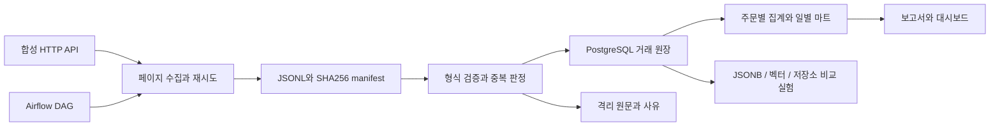

# 설계와 데이터 계약

## 데이터 계약

주문 ID, 결제 이벤트 ID, 배송 이벤트 ID를 식별자로 사용합니다. 상품 1:N 주문, 주문 1:N 결제, 주문 1:N 배송 관계입니다. 금액은 정수 원화이며 수량은 양의 정수입니다. Python의 bool은 정수로 인정하지 않습니다. 시각은 시간대가 있는 값이어야 하며 발생 시각 이후에 수신됩니다. DB에는 timestamptz, 날짜 집계에는 Asia/Seoul을 사용합니다.

`occurred_at`은 사건 발생, `received_at`은 수신 시각입니다. 수집 파티션은 수신 날짜입니다. 환불이 늦게 오더라도 기존 주문일 코호트의 순수납액을 갱신합니다. 결제일 현금 흐름은 다른 지표이며 `003_analysis.sql`에서 별도로 계산합니다.

## 정합성과 복구

수집기는 429/5xx를 제한적으로 재시도하고 페이지 순환, 총건수, 파일 해시를 확인합니다. JSONL 파일을 원자적으로 교체한 후 manifest를 기록합니다. 적재 전에 manifest와 파일이 일치하지 않으면 중단합니다.

적재기는 advisory lock으로 배치를 직렬화합니다. raw 원장, 정형 테이블, 격리, 마트, 체크포인트를 같은 트랜잭션에 기록합니다. 동일 이벤트 ID·동일 해시는 재전송이며, 동일 ID·다른 해시는 충돌로 격리합니다. 이미 처리한 동일 배치는 건너뜁니다. 이는 재시도 가능한 멱등 처리이며 분산 시스템의 exactly-once를 보장한다는 뜻은 아닙니다.

부모 주문 없는 결제는 격리하고 이후 배치에서 부모가 도착하면 재처리합니다. 격리율 5% 초과, 과도한 환불 등은 배치를 롤백합니다. 실패 실행 기록과 경고는 별도 트랜잭션에 남습니다. 외부 Slack/이메일 전송은 없습니다.

결제·배송을 먼저 주문별로 집계하고 JOIN하여 다대다 결합에 따른 금액 중복을 막습니다. raw/정형 원장은 증분 적재하지만 마트는 전체 재계산합니다. 현재 6천 주문에서는 단순하고 검증하기 쉽습니다. 대규모 운영에서는 영향받은 주문·날짜만 재계산하고 파티셔닝, 인덱스, 보존 정책을 추가해야 합니다. 수집기도 파티션을 메모리에 올리므로 무제한 스트리밍 처리라고 주장하지 않습니다.

## 저장소 선택

PostgreSQL은 FK·트랜잭션·정산의 기준입니다. JSONB는 가변 상품 속성을 담고 자주 조회하는 속성은 일반 컬럼 승격을 실험합니다. Redis는 없어져도 다시 만드는 캐시, Neo4j는 판매자를 통한 2홉 탐색, MongoDB는 문서 모델 비교 실험입니다. 운영 경로에 여러 DB를 모두 넣지 않았고 DB 간 원자적 동기화도 구현하지 않았습니다. CAP는 네트워크 분할 시 일관성·가용성 선택을 설명하는 개념이지 DB별 고정 성능 순위가 아닙니다.

벡터 실험은 두 가지입니다. 해시 기반 128차원 벡터는 재현 가능한 검색 기준선이며 의미 이해 모델이 아닙니다. 별도 384차원 MiniLM 임베딩에는 모델 이름·revision·콘텐츠 해시를 저장합니다. 4개 질의는 시연용 수작업 표본으로 일반적인 검색 정확도를 증명하지 않습니다. ANN recall은 별도 난수 벡터에서 exact 결과와 비교합니다.

관측성은 실행 성공·실패/시간, 데이터 품질·격리, 업무 금액·배송 지연의 세 층입니다. 실제 외부 원장과 대조하는 운영 정확성, 접근 권한 분리, 고가용성, 장기 부하 테스트는 후속 과제입니다.
