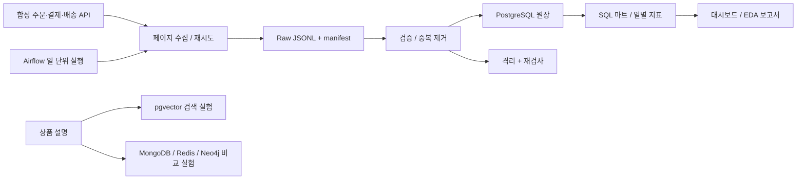

# ShopScope 데이터 진단 보고서

## 데이터 출처·수집 방식·규모

직접 만든 가상 이커머스 원천입니다. seed=42, 주문 6,000건, 상품 80개입니다.
실제 고객 정보와 실거래는 포함하지 않습니다. 로컬 HTTP API에서 수신 날짜별로 페이지를 순회하고,
파일 해시·건수 매니페스트를 검증한 뒤 PostgreSQL에 적재했습니다. 이 결과로 실제 시장 수요를 추정하지 않습니다.
마지막 처리 파티션: 2026-09-03. 생성 시각: 2026-09-29T04:27:02.501328+00:00.

## 정형/반정형/비정형별 프로파일

| 지표 | 값 | 정의 |
|---|---:|---|
| 주문 GMV | 203,049,000원 | 주문 수량 × 주문 당시 단가, 환불 전 |
| 누적 결제액 | 203,049,000원 | 중복 제거한 capture 원장 합계 |
| 누적 환불액 | 7,937,000원 | 수신 완료한 refund 원장 합계 |
| 순수납액 | 195,112,000원 | 결제 − 환불. 회계상 매출·이익과 다름 |
| 배송 완료 주문 | 6,000건 | 배송 완료 이벤트가 있는 주문 |
| 배송 지연 주문 | 1,200건 | 완료 시각이 약속 시각보다 늦은 주문 |

주문은 한 주문에 한 상품인 단순화 모델입니다. 채널은 web/app/market, 상품별 속성은 JSONB에 둡니다.
상품 설명의 길이·중복·문자 정규화, 상품 이미지 메타데이터, 통계/이상치 탐지는 `profile.json`을 참고합니다.
일별 지표는 **주문일 코호트**입니다. 8월 1일 주문의 늦은 환불도 8월 1일 순수납액을 바꿉니다.
정산 발생일별 현금 흐름은 별도 SQL(`sql/003_analysis.sql`)로 제공합니다.

## 품질 이슈 목록과 심각도

현재 미해결 격리 31건. 원천 JSON과 사유를 보존합니다.

| 출처 | 사유 | 상태 | 건수 |
|---|---|---|---:|
| orders | invalid_quantity | open | 30 |
| payments | orphan_order | open | 1 |

잘못된 수량·부모 없는 결제는 행 단위로 격리하고 경고를 남깁니다. 배치 격리율이 5%를 넘거나 환불이
결제보다 많으면 해당 배치 전체를 롤백합니다. 5%는 합성 시나리오용 정책값이며 실무 기준으로 일반화하지 않습니다.
배송 지연은 업무 성과 문제이지 형식 오류가 아니므로 삭제하지 않습니다. 미래 시점의 배송 미완료를 지연으로
단정하지 않습니다. 결제 불일치도 주문 직후에는 정상일 수 있어 자동 삭제하지 않고 검토 지표로 남깁니다.
정확성은 생성기의 독립된 정답 합계로 검증한 범위에 한합니다. 실제 외부 원장과의 정확성은 검증하지 않았습니다.

## 문서 처리 관점의 권고

1. 상품 설명 원문과 정규화한 텍스트를 구분하여 보관합니다. 유사한 이름만으로 다른 상품을 합치지 않습니다.
2. 바이트 해시는 완전 중복, n-gram 유사도는 근사 중복 후보 탐지에 사용합니다. 근사 중복은 자동 삭제하지 않습니다.
3. 동일 판매자 후보는 이름 정규화 이후에도 판매자 ID 같은 식별 근거로 확정합니다.
4. 통계적 이상치만으로 고액 주문을 제거하지 않습니다. 오류 판정과 업무상 특이 주문을 분리합니다.
5. 단어 해시 벡터 실험의 유사도를 신경망 의미 이해 성능으로 해석하지 않습니다.

## 파이프라인 아키텍처 다이어그램

실선은 구현된 흐름입니다. 실제 검증 상태는 `validation.json`과 `docs/VERIFICATION.md`에서 별도로 확인합니다.
이 도식은 배포 완료나 운영 환경 검증을 의미하지 않습니다.
